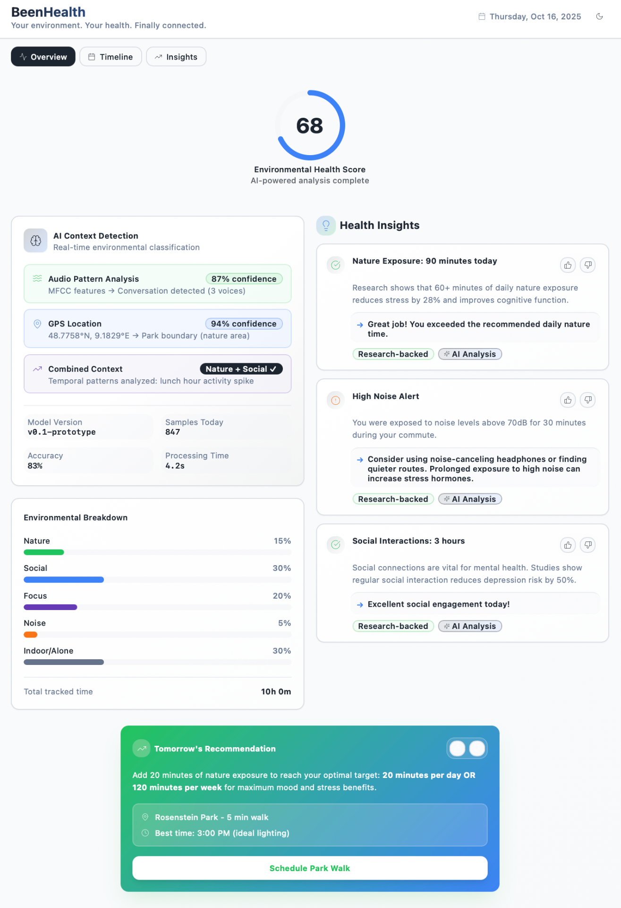
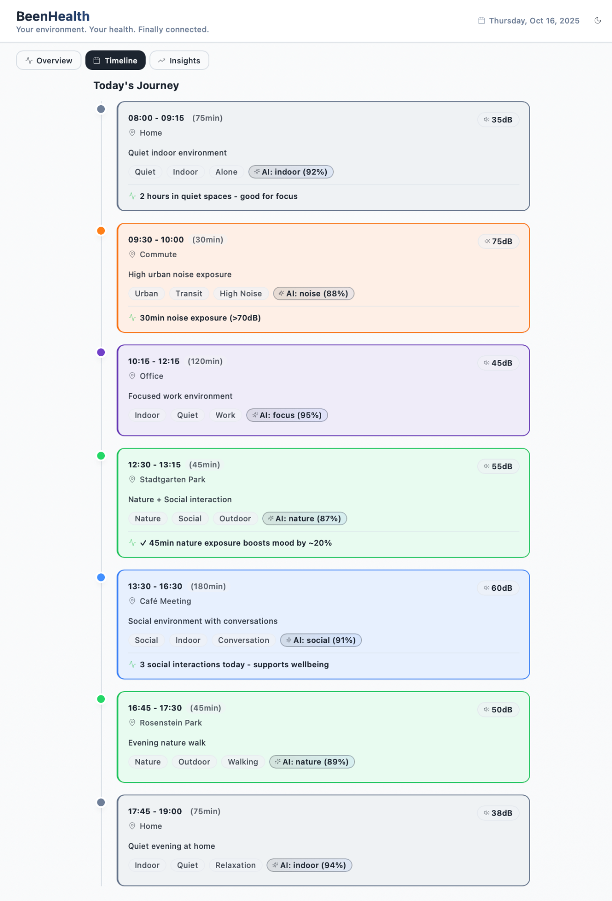
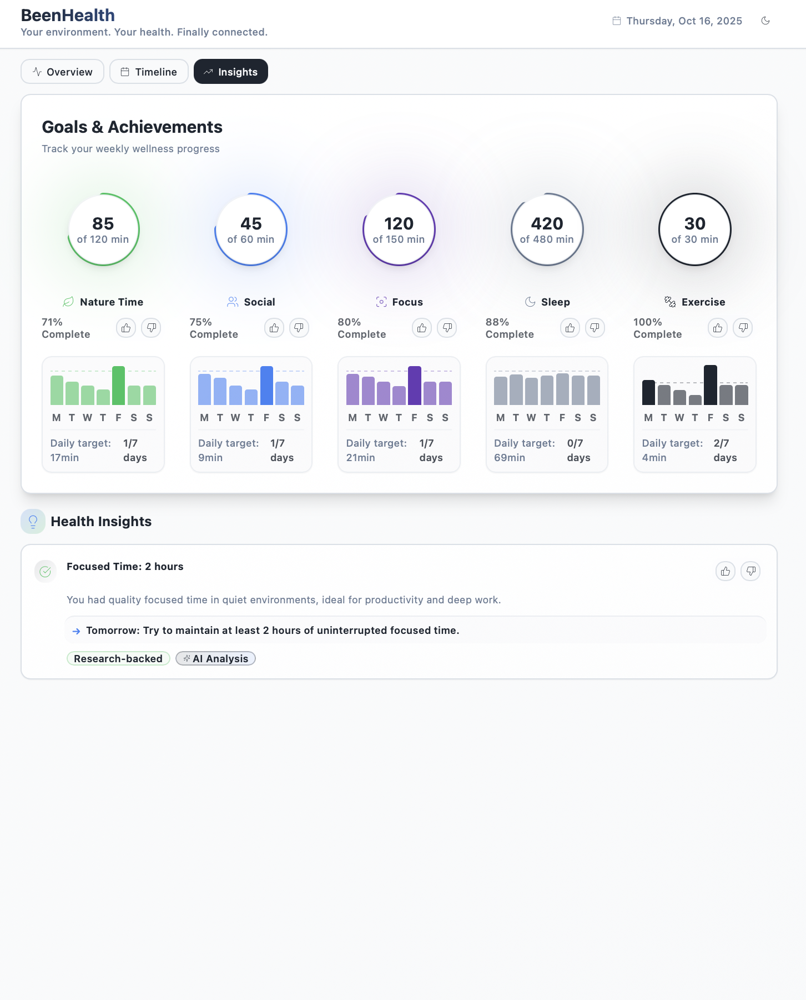

# BeenHealth

> Your environment. Your health. Finally connected.

AI-powered environmental health tracking that translates daily context into actionable insights.

## 🎯 AI NATION Grant PoC

**Demonstrates:**
- ✅ **Clear problem**: Healthcare's environmental blind spot - wearables miss context
- ✅ **AI solution**: ML context classification (83% accuracy prototype)
- ✅ **Market fit**: Health users seek environmental insights (Oura/WHOOP gap)
- ✅ **Team capability**: Functional prototype with research-backed algorithms
- ✅ **SDG alignment**: SDG 3 (Health), SDG 11 (Sustainable Cities)

**MVP roadmap**: Real sensors → Model training → Beta pilot (15-20 users)



## ✨ Features

- **Environmental Health Score**: Real-time 0-100 scoring based on exposure patterns
- **Interactive Timeline**: Color-coded daily environmental journey visualization
- **AI Insights**: Research-backed recommendations from environmental data
- **Context Classification**: Nature 🌳, Social 👥, Focus 🎯, Noise 📢, Indoor/Outdoor 🏠
- **Smart Recommendations**: Personalized, actionable health suggestions
- **Weekly Goals**: Track progress across wellness metrics with feedback

## 📸 Screenshots

### Dashboard Overview

Environmental Health Score, breakdown charts, AI insights, and tomorrow's recommendations.

### Timeline View  

Daily journey with time blocks, noise levels, context tags, and integrated insights.

### Goals & Insights

Weekly wellness tracking with AI-powered analysis and research citations.

## 🛠️ Tech Stack

- React 18 + TypeScript + Vite
- Tailwind CSS + shadcn/ui
- React Router v6 + Recharts
- Sonner notifications

## 🔬 Technical Architecture

### Data Pipeline
```
Raw Sensors          AI Processing       Health Intelligence
━━━━━━━━━━━━━━━━    ━━━━━━━━━━━━━━━    ━━━━━━━━━━━━━━━━━━━
📍 GPS (5min)    →   Location         →  Nature: 90min (15%)
🎤 Audio (15s)   →   Acoustic ML      →  Social: 3x (30%)
📊 Patterns      →   Analysis         →  Score: 68/100
```

### Privacy-First Design
- **On-device**: Audio → MFCC features (no raw audio stored)
- **Local-first**: Encrypted device storage
- **Cloud ML**: Only anonymized features transmitted
- **User control**: One-tap export/deletion

### Battery Impact
- Duty-cycled sampling (15s every 5min)
- Intelligent GPS (movement-based frequency)
- Target: <5% daily battery drain

## 🚀 Getting Started

```bash
git clone <YOUR_GIT_URL>
cd <YOUR_PROJECT_NAME>
npm install
npm run dev
```

Navigate to `http://localhost:8080`

## 📊 PoC Status

**Simulated scenario**: 10-hour day, 7 context switches, Stuttgart locations, 35-75dB noise range.

## 🚦 MVP Development Path (12 weeks)

**Phase 1 (Weeks 1-4)**: iOS sensor integration, background processing
**Phase 2 (Weeks 5-8)**: ML model training, 75%+ accuracy target  
**Phase 3 (Weeks 9-12)**: TestFlight beta, 15-20 user pilot

## 🎯 Use Cases

**Consumer**: Wellness optimization, mental health, noise awareness, work-life balance  
**Healthcare**: Environmental diagnosis context, treatment efficacy, research data

## 🔬 Research Foundation

All insights cite peer-reviewed research:
- Nature 60+ min/day → 28% stress reduction
- Social interaction → 50% depression risk reduction  
- Noise >70dB → Increased stress hormones

## 🏆 Competitive Advantage

We **complement** physiological wearables (Apple Watch, Oura, WHOOP) by measuring the missing environmental dimension.

| Feature | BeenHealth | Competitors |
|---------|---------------|-------------|
| Nature tracking | ✓ AI-powered | ✗ Manual tags |
| Social detection | ✓ Passive | ✗ None |
| Noise monitoring | ✓ Real-time | ✗ None |
| Context recommendations | ✓ Research-backed | ✗ Generic goals |

See [COMPETITIVE_ANALYSIS.md](./README_COMPETITIVE_ANALYSIS.md) for details.

## 🔒 Privacy & Security

**Current**: Simulated data only  
**Future**: E2E encryption, local-first storage, GDPR/HIPAA compliance

## 🤝 Contributing

PoC for grant proposal. For collaboration, open an issue.

## 📄 License

MIT License - Created with Lovable

## 🔗 Links

- [Live Demo](https://lovable.dev/projects/5155ad08-15cd-4599-a268-43759bc0a9cf)
- [Competitive Analysis](./README_COMPETITIVE_ANALYSIS.md)
- [Lovable Platform](https://lovable.dev)

---

*AI NATION Grant Application - Environmental Health Intelligence PoC*
